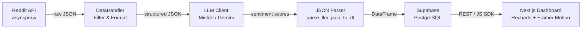

# Stock Analyser


## Overview

Stock Analyser is a multi-stage data pipeline that collects posts and comments from finance-focused subreddits via the Reddit API, submits the structured content to a configurable LLM (Mistral or Gemini) for per-ticker sentiment scoring, and persists the results to a Supabase PostgreSQL database. A Next.js dashboard consumes the stored data to render sentiment trends, top-mentioned assets, and aggregate statistics.

## Technical Architecture



### Pipeline Phases

| Phase         | Module                        | Description                                                                                                                                                                                                             |
| ------------- | ----------------------------- | ----------------------------------------------------------------------------------------------------------------------------------------------------------------------------------------------------------------------- |
| 1 – Scrape    | `data/reddit_client.py`       | Async PRAW fetches top posts and filtered comments from 7 target subreddits. Posts are filtered by flair, minimum score, and comment length.                                                                            |
| 2 – Format    | `data/data_handler.py`        | Raw JSON is cleaned (optional non-ASCII removal), deduplicated, and written to `stock_data/llm_input/` as one JSON file per subreddit. Incremental processing skips already-existing output files.                      |
| 3 – Analyse   | `LLM/`                        | A factory pattern selects the active provider (`mistral` or `gemini`). Each input file is sent to the LLM with a structured system prompt. The response is parsed into a `pandas` DataFrame via `utils/json_parser.py`. |
| 4 – Persist   | `database/supabase_client.py` | Normalised records are upserted into three tables: `platforms`, `assets`, and `asset_mentions`.                                                                                                                         |
| 5 – Visualise | `frontend/`                   | Next.js app reads from Supabase and renders interactive charts.                                                                                                                                                         |

## Problem Domain

Public financial discussion on Reddit contains high-frequency, unstructured signals about individual equities. Manually monitoring multiple subreddits and extracting per-ticker sentiment at scale is not tractable. This pipeline automates collection, LLM-based extraction, and structured storage of those signals, making them queryable and visualisable.

## Key Features

- Scrapes 7 configurable subreddits with per-subreddit flair and score filters.
- Supports two LLM backends (Mistral, Gemini) selectable via a single config flag; rate limits are enforced per provider.
- Incremental file processing: skips subreddits already present in `llm_input/` to avoid redundant API calls.
- Normalised 3-table PostgreSQL schema (`platforms`, `assets`, `asset_mentions`) with `NUMERIC(5,4)` precision for sentiment and confidence scores.
- Next.js dashboard with Recharts visualisations: sentiment trend chart, top-stocks table, and aggregate stats cards.
- Framer Motion animations and Tailwind CSS dark-mode design system in the frontend.
- CLI flags for full pipeline, test mode (single random subreddit), and parse-only mode (re-parse a saved LLM output file).
- Structured JSON logging with configurable log level and optional disk persistence.

## Tech Stack

### Backend

| Category        | Technology    | Version                 |
| --------------- | ------------- | ----------------------- |
| Language        | Python        | 3.11+                   |
| Reddit API      | asyncpraw     | latest                  |
| LLM – Option A  | Mistral AI    | `mistral-small-latest`  |
| LLM – Option B  | Google Gemini | `gemini-2.5-flash-lite` |
| Data Processing | pandas        | latest                  |
| Database Client | supabase-py   | latest                  |
| Config          | python-dotenv | latest                  |

### Frontend

| Category   | Technology            | Version  |
| ---------- | --------------------- | -------- |
| Framework  | Next.js               | 16.1.6   |
| UI Library | React                 | 19.2.3   |
| Charts     | Recharts              | ^3.7.0   |
| Animations | Framer Motion         | ^12.34.0 |
| Icons      | Lucide React          | ^0.564.0 |
| Styling    | Tailwind CSS          | ^4       |
| DB Client  | @supabase/supabase-js | ^2.96.0  |
| Language   | TypeScript            | ^5       |

### Infrastructure

| Category         | Technology            |
| ---------------- | --------------------- |
| Database         | Supabase (PostgreSQL) |
| Containerisation | Docker Compose        |

## Installation & Usage

### Prerequisites

- Python 3.11+
- Node.js 18+
- A Reddit application (OAuth2 credentials)
- A Mistral AI **or** Google Gemini API key
- A Supabase project

### 1. Clone & Configure

```bash
git clone https://github.com/your-username/stock-analyser.git
cd stock-analyser
cp .env.example .env
```

Populate `.env`:

| Variable          | Required | Description                            |
| ----------------- | -------- | -------------------------------------- |
| `CLIENT_ID`       | ✅       | Reddit OAuth2 client ID                |
| `CLIENT_SECRET`   | ✅       | Reddit OAuth2 client secret            |
| `USER_AGENT`      | ✅       | Reddit API user agent string           |
| `MISTRAL_API_KEY` | ⚠️       | Required if `ACTIVE_MODEL = "mistral"` |
| `GEMINI_API_KEY`  | ⚠️       | Required if `ACTIVE_MODEL = "gemini"`  |
| `SUPABASE_URL`    | ✅       | Supabase project URL                   |
| `SUPABASE_KEY`    | ✅       | Supabase anon/service key              |

### 2. Backend Setup

```bash
pip install -r requirements.txt
```

Apply the database schema to your Supabase project:

```bash
# Paste contents of database/schema.sql into the Supabase SQL editor, or use psql:
psql "$SUPABASE_URL" -f database/schema.sql
```

### 3. Run the Pipeline

```bash
# Full pipeline: scrape → analyse → persist
python main.py

# Test mode: process one random subreddit only
python main.py --test

# Re-parse a saved LLM output file (no scraping or API calls)
python main.py --parse-only path/to/output.json
```

### 4. Frontend Setup

```bash
cd frontend
cp .env.local.example .env.local   # add NEXT_PUBLIC_SUPABASE_URL and NEXT_PUBLIC_SUPABASE_ANON_KEY
npm install
npm run dev
```

The dashboard is available at `http://localhost:3000`.

### Key Configuration Options (`config.py`)

| Variable             | Default     | Description                                                           |
| -------------------- | ----------- | --------------------------------------------------------------------- |
| `ACTIVE_MODEL`       | `"mistral"` | LLM provider to use (`"mistral"` or `"gemini"`)                       |
| `TIMEFRAME`          | `"week"`    | Reddit post timeframe (`hour`, `day`, `week`, `month`, `year`, `all`) |
| `COMMENT_LIMIT`      | `10`        | Max top comments fetched per post                                     |
| `MIN_SCORE_POST`     | `10`        | Minimum post upvotes to include                                       |
| `MIN_SCORE_COMMENT`  | `10`        | Minimum comment upvotes to include                                    |
| `MIN_COMMENT_LENGTH` | `30`        | Minimum comment character length                                      |
| `MERGE_LLM_OUTPUT`   | `False`     | Combine all subreddit files into one before LLM submission            |
| `REMOVE_NON_ASCII`   | `True`      | Strip emojis and non-ASCII characters to reduce token usage           |
| `KEEP_LLM_INPUT`     | `False`     | Retain intermediate JSON files in `stock_data/llm_input/`             |
| `KEEP_LLM_OUTPUT`    | `False`     | Retain per-file CSV outputs in `stock_data/llm_output/`               |

## License

This project is licensed under the MIT License. See [LICENSE](LICENSE) for details.
